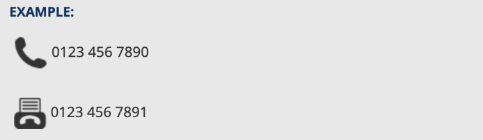
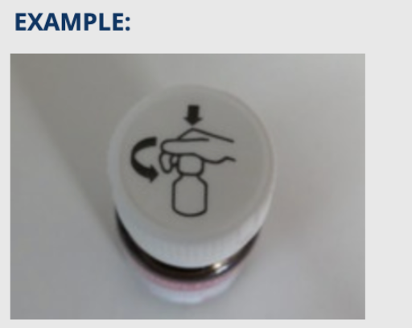
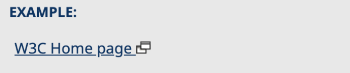
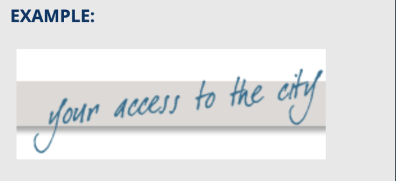
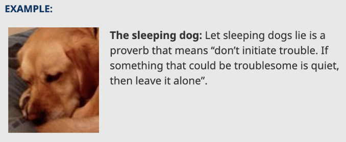

# Images
Images must have text alternatives that describe the information or function 
represented by them so they can be read and understood by those using screen readers.

## Alternative text for images
* All `` elements should have an `alt` attribute provided
    * When not provided many screen readers will fallback to reading the file name instead
* The `alt` value should not include words like _“image”_, _“picture”_ or _“icon”_
    * Screen readers are already announcing that the element is an image
* Images that are decorative only and provide no information or function to the page should be hidden from Assistive 
Technologies by providing an empty `alt` attribute (`alt=””`)
    * Make sure the value is empty and does not include a space character (ex. `alt=” “`)

## Informative Images
Images that graphically represent concepts and information.
* `alt` should be a short description conveying the essential information 
presented by the image

### Example 1

```html
<p>
    
    0123 456 7890
</p>
<p>
    
    0123 456 7891
</p>
```

### Example 2

```html

```

## Functional Images
Images used to initiate actions rather than to convey information, 
typically in `buttons`, `links`, and other interactive elements
* `alt` should convey the action that will be initiated (the purpose of the image), 
rather than a description of the image

### Example 1

```html
<a href="javascript:print()">
    
</a>
```

### Example 2

```html
<a href="https://w3.org" target="_blank">
    W3C Home Page 
    
</a>
```

## Images of text
Image displaying text that is meant to be read
* Better design practice is to use actual text that is styled with CSS rather 
than image-based text presentation
* But if you must… `alt` should contain the same exact text contained in the image

### Example

```html

```

## Decorative Images
Only add visual decoration to the page - they do not add any additional 
information that is important to understanding the page.
* Text values for these types of images would add audible clutter to screen 
reader output or could distract users
* `alt` should be provided but empty (without any space characters!)

### Example

```html
<p>
    
    <strong>The sleeping dog:</strong> 
    Let sleeping dogs lie...
</p>
```

## References
* https://www.w3.org/WAI/tutorials/images/
* https://www.w3.org/WAI/tutorials/images/decision-tree/
* https://www.w3.org/WAI/tutorials/images/tips/
* https://www.w3.org/WAI/tutorials/images/informative/
* https://www.w3.org/WAI/tutorials/images/functional/
* https://www.w3.org/WAI/tutorials/images/textual/
