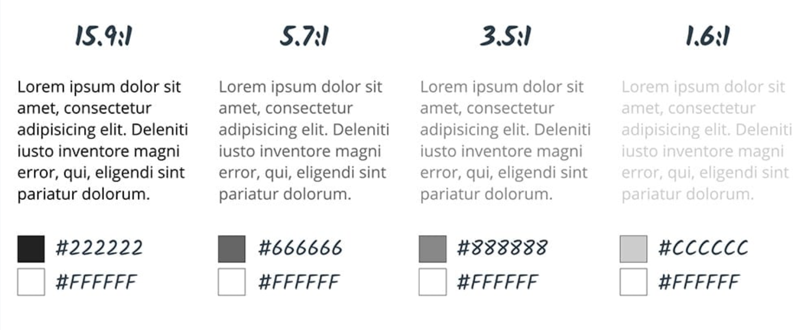

# Color Contrast
When contrast between foreground and background colors is not sufficient it can 
be hard to distinguish outlines, borders, edges, and details and text can be 
hard to read.

## Contrast Ratios

## Do not use color alone to convey meaning
**WCAG 2.1 Level A requirement:** Color is not used as the only visual means of conveying 
information, indicating an action, prompting a response, or distinguishing a visual element.

* Impacted Users:
    * vision impaired or older users
    * cognitive impaired
    * temporarily limited such as experiencing screen glare
* Impact:
    * These users may not be able to see/understand the differences in color and require additional indicators
* Solution:
    * Along with color, use additional indicators such as:
        * typography
        * shapes
        * grids
        * spaces
        * and/or allocate more weight to important elements

## References
* https://webaim.org/resources/contrastchecker/
* https://color.review/
* https://www.scottohara.me/blog/2019/02/12/high-contrast-aria-and-images.html
* [Css media query: -ms-high-contrast](https://www.gwhitworth.com/blog/2017/04/how-to-use-ms-high-contrast/)
